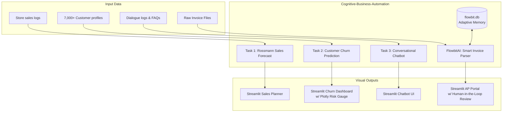

# Cognitive Business Automation Suite

<p align="left">
  
  
  
  
  
</p>

An enterprise-grade portfolio of four data intelligence and cognitive automation systems. These projects leverage predictive modeling, natural language processing, and adaptive memory agents to solve operational corporate challenges—ranging from revenue forecasting and customer retention to conversational support and automated accounting.

---

## 🏗️ Architecture & Operations Flow

This suite covers three distinct branches of modern business AI: **Predictive Analytics**, **Conversational AI**, and **Agentic Automation**:



---

## 📂 Project Suite Overview

### 1. 📊 Rossmann Store Sales Forecasting (`task-1`)
* **Core Function:** Predicts daily sales for drugstores up to 6 weeks in advance using store properties, competitor presence, promotion status, and holiday calendars.
* **Architecture:** Pipeline-driven data cleaning, engineering time-based features, training robust regressors, and exposing predictions via a Streamlit interface.
* **Key Components:**
  * `train.csv` / `test.csv` / `store.csv` — Raw Kaggle data.
  * `generate_notebook.py` — Script to automate pipeline builds.
  * `app.py` — Interactive forecaster visualization.

### 2. 📉 Telco Customer Churn Predictor (`Task-2`)
* **Core Function:** Classifies customer profiles according to churn risk. It calculates individual churn probabilities and segments customers into Low, Medium, and High-risk tiers.
* **Interface & UX:** Includes a polished Streamlit dashboard equipped with a **Plotly Gauge Chart** representing real-time risk scores and dynamically suggests custom business retention actions based on the predicted risk.
* **Key Components:**
  * `Task_2.ipynb` — Explanations of EDA, scaling, and models (Logistic Regression, Random Forest, XGBoost).
  * `best_model.pkl` & `scaler.pkl` — Trained classification models and transformers.
  * `app.py` — Interactive web application.

### 3. 🤖 Conversational Support Assistant (`Task-3`)
* **Core Function:** A smart retrieval-based QA bot designed to resolve support queries and parse customer dialogues using standard information retrieval (TF-IDF/Cosine Similarity) against a knowledge base.
* **Key Components:**
  * `knowledge_base.json` — Structured domain knowledge.
  * `dialogs.txt` — Conversation history logs.
  * `app.py` — User-facing chat interface.
  * `test_smart_bot.py` — Automated QA testing scripts.

### 4. 💸 FlowbitAI: Adaptive Invoice Processing (`FlowbitAI`)
* **Core Function:** An intelligent accounts payable automation agent. It parses invoices, links them to Purchase Orders, identifies duplicates, and implements a self-learning **Adaptive Memory System**.
* **Fuzzy Self-Correction:** When parsing a vendor name typo (e.g., `Vndr_Inc`), the system queries its SQLite database (`flowbit.db`) using fuzzy string similarity. If a similarity > 80% is found to a corrected past vendor name, it **automatically swaps** the value before displaying.
* **Human-in-the-Loop:** User overrides and approved entries on the review page are immediately saved back to memory to improve future parsing.
* **Key Components:**
  * `app.py` — Multi-page Streamlit portal (Upload Dashboard & Invoice Review).
  * `demo_runner.py` — Script that boots up demo mock invoice generators, sets up database states, and guides the user through video generation.
  * `flowbit.db` — Adaptive learning SQL database.

---

## 🛠️ Installation & Setup

### 1. Clone the Repository
```bash
git clone <repository-url>
cd Cognitive-Business-Automation
```

### 2. Environment Configuration
Create a virtual environment (Python 3.10+ recommended) to install dependencies:
```bash
python -m venv venv
# Windows:
venv\Scripts\activate
# macOS/Linux:
# source venv/bin/activate
```

---

## 🚀 Running the Applications

Each module runs a standalone Streamlit web application.

### 1. Run the Rossmann Sales Forecaster (Task 1)
```bash
cd task-1
# Install Task 1 requirements
pip install -r ../FlowbitAI/requirements.txt
# Run the app
streamlit run app.py
```

### 2. Run the Churn Predictor (Task 2)
```bash
# Install Task 2 packages
pip install pandas numpy scikit-learn joblib streamlit plotly

# Run the app
streamlit run app.py
```
*Input demographic details in the sidebar and click **Predict Churn** to render the risk gauge.*

### 2. Run the Support Chatbot (Task 3)
```bash
cd Task-3
pip install -r requirements.txt
streamlit run app.py
```

### 3. Run FlowbitAI
```bash
cd FlowbitAI
pip install -r requirements.txt

# Initialize database
python -m src.init_db

# Run automated demo guide
python demo_runner.py

# Launch Streamlit AP portal
streamlit run app.py
```

---

## 🛡️ License

This project is licensed under the MIT License. See individual tasks for more details.
